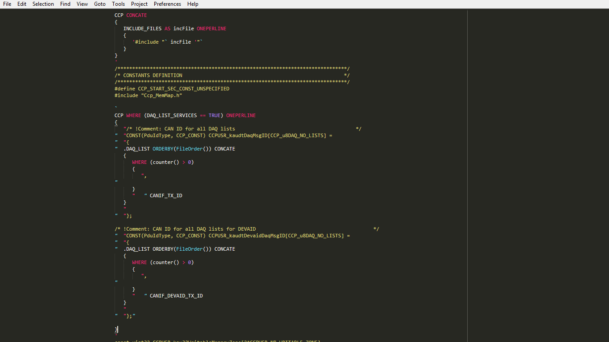
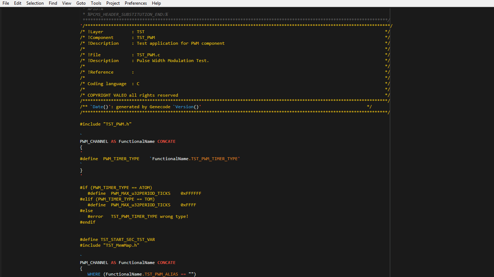
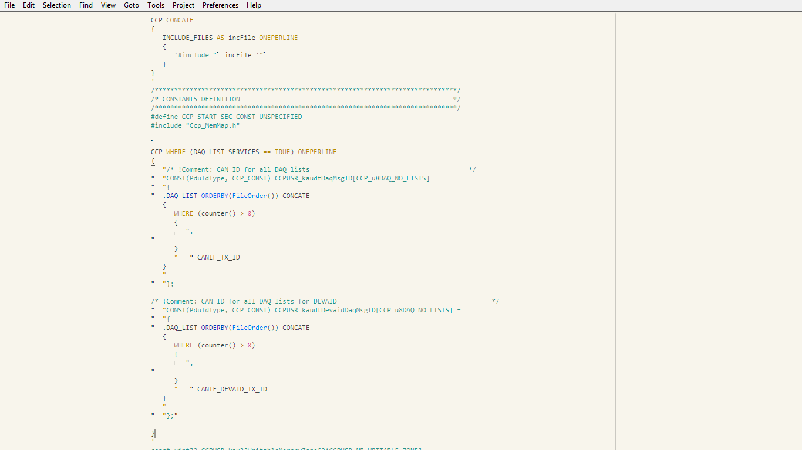
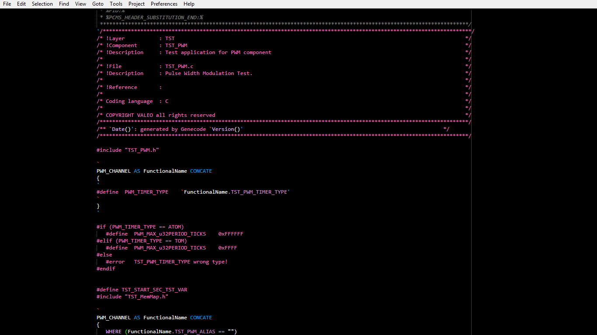

# OIL_TPL

### An OSEK Implementation Language (OIL) Syntax Language for [Sublime Text](http://www.sublimetext.com/).

## About

OIL_TPL is an initial attempt at making a complete OSEK Implementation Language (OIL) syntax language for [Sublime Text](http://www.sublimetext.com/).
For now, only .tpl files are supported. Bugs are expected, so please report them to me. Hopefully, I'll be constantly updating the package in the next weeks till I hit v1.0.0.

OIL_TPL covers an array of syntax scopes, thus it is represented differently by every color scheme (theme).

Here are some examples:
___
###Monokai

[View a larger screenshot](https://raw.githubusercontent.com/ahmedhassan-eng/OIL_TPL/master/screenshots/monokai.png)
___
###Brogrammer

[View a larger screenshot](https://raw.githubusercontent.com/ahmedhassan-eng/OIL_TPL/master/screenshots/brogrammer.png)

___
###Creamy

[View a larger screenshot](https://raw.githubusercontent.com/ahmedhassan-eng/OIL_TPL/master/screenshots/creamy.png)
___
###Neon

[View a larger screenshot](https://raw.githubusercontent.com/ahmedhassan-eng/OIL_TPL/master/screenshots/neon.png)

## Installation for [Sublime Text](http://www.sublimetext.com/)

###Recommended
For easy installation, install with [Package Control](https://packagecontrol.io/installation).

1. <kbd>Ctrl</kbd> + <kbd>Shift</kbd> + <kbd>P</kbd> (Win/Linux)   <kbd>Cmd</kbd> + <kbd>Shift</kbd> + <kbd>P</kbd> (OS X)
2. Type `Package Control: Install Package`
3. Search `OIL_TPL`

**Other Methods**

You can clone the repo to your `Packages` folder.

Of course, you can always [install manually](https://github.com/ahmedhassan-eng/OIL_TPL/archive/master.zip), too. However, that's not recommended since the other options update the package automatically!

## Activating

OIL_TPL automatically takes over .tpl files.
You can always switch syntax using menu `View >> Syntax >> OIL`

*** IMPORTANT - MAKE SURE TO RESTART SUBLIME AFTER INSTALLING AND ACTIVATING ***
